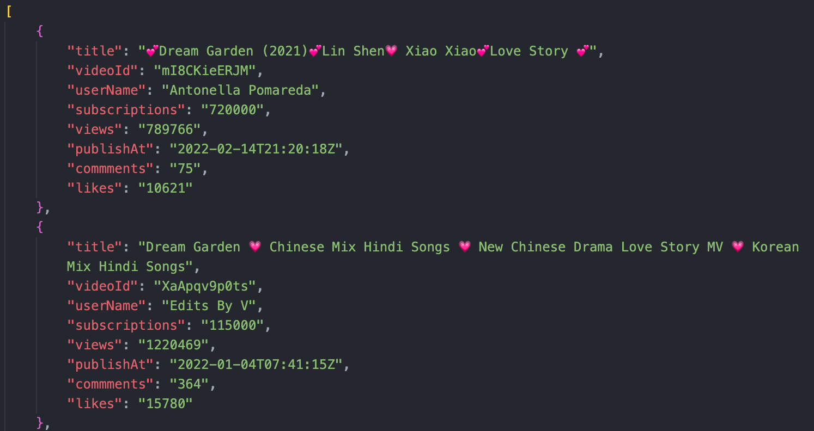

# Youtube crawler

The program is written by **Python** based on the **Google youtube v3 API**. The basic function is to scrape various information from youtube videos. 

Input the search terms, the program will automatically search all related videos, retrieve and return video information seperately.

## The information this tool crawl includes:
- title
- video id
- channel name
- number of subscriptions
- number of views
- publish date
- number of comments
- number of likes

## How to run the program
1. Git clone current repo
2. Pip install used packages
3. Get the api key from [google developer console](https://console.cloud.google.com/apis/), change the **developer api key** in test.py.
4. Add search term inside bottom function
5. Input the quota (number of videos'information return)
6. Run python3 test.py

## Sample Output
One .xlsx file one search. Check the sample output shown below.

